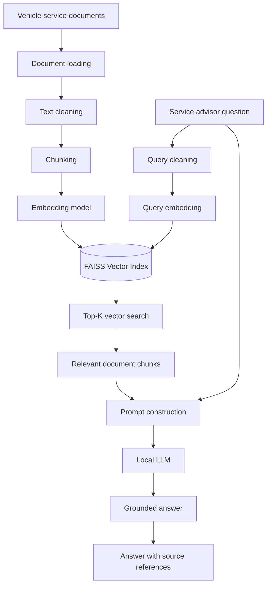
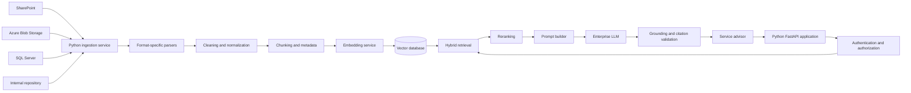

# Vector-Based RAG Case Study Using Python

## Case study: Volkswagen Vehicle-Service Knowledge Assistant

Volkswagen service centres maintain information in:

* Vehicle service manuals
* Battery inspection guidelines
* Brake inspection procedures
* Diagnostic-code documents
* Warranty policies
* Service bulletins
* Customer-support documents

A service advisor may ask:

> “A Volkswagen Taigun is taking longer to start and the battery voltage is 11.4 V. What should be inspected?”

A normal LLM may answer using its general training knowledge. A **Retrieval-Augmented Generation system** first retrieves relevant information from approved Volkswagen documents and then asks an LLM to generate an answer using that context.

Sentence Transformers supports this semantic-search pattern: documents and questions are converted into vectors in the same embedding space, after which the closest document embeddings are retrieved. ([Sentence Transformations][1])

---

# 1. Business problem

## Current challenges

Service advisors may need to search through hundreds or thousands of documents manually.

Traditional keyword search may have problems such as:

* The user enters “slow starting,” but the document contains “extended cranking.”
* The user enters “battery problem,” but the document contains “low system voltage.”
* The user describes symptoms without knowing the component name.
* Search results may return complete documents instead of the relevant section.

## Proposed solution

Develop a vector-based RAG application that:

1. Reads service documents.
2. Cleans the document text.
3. Divides documents into smaller chunks.
4. Converts every chunk into an embedding vector.
5. Stores vectors in FAISS.
6. Converts the user question into a vector.
7. Retrieves the most similar chunks.
8. Sends the question and retrieved chunks to an LLM.
9. Generates an answer with source references.

---

# 2. RAG architecture



---

# 3. Technology stack

| Component              | Technology                                    |
| ---------------------- | --------------------------------------------- |
| Programming language   | Python                                        |
| Embedding model        | Sentence Transformers                         |
| Embedding model name   | `all-MiniLM-L6-v2`                            |
| Vector search          | FAISS                                         |
| Similarity measurement | Cosine similarity                             |
| Local generation model | FLAN-T5                                       |
| LLM framework          | Hugging Face Transformers                     |
| Document metadata      | Python dictionaries                           |
| Input documents        | Text, PDF-extracted text, Word-extracted text |

For cosine similarity with FAISS, vectors should be normalized and searched through an inner-product index such as `IndexFlatIP`. FAISS documents this normalized inner-product approach as equivalent to cosine-similarity search. ([GitHub][2])

---

# 4. Project structure

```text
vehicle-rag-case-study/
│
├── rag_vehicle_service.py
├── requirements.txt
│
├── documents/
│   ├── battery_guideline.txt
│   ├── brake_guideline.txt
│   ├── engine_warning_guideline.txt
│   ├── service_interval.txt
│   └── fuel_efficiency.txt
│
└── storage/
    ├── vehicle_service.index
    └── chunk_metadata.json
```

The first example below creates the documents directly inside Python, so the folder structure is optional for the initial demonstration.

---

# 5. Install required libraries

## `requirements.txt`

```text
sentence-transformers
faiss-cpu
transformers
torch
numpy
```

Install them using:

```bash
pip install sentence-transformers faiss-cpu transformers torch numpy
```

For Google Colab:

```python
!pip install -q sentence-transformers faiss-cpu transformers torch
```

---

# 6. Complete Python implementation

Save the following as:

```text
rag_vehicle_service.py
```

```python
from __future__ import annotations

import json
import re
from dataclasses import asdict, dataclass
from pathlib import Path
from typing import Any

import faiss
import numpy as np
from sentence_transformers import SentenceTransformer
from transformers import pipeline


# ============================================================
# 1. CONFIGURATION
# ============================================================

EMBEDDING_MODEL_NAME = "all-MiniLM-L6-v2"
GENERATION_MODEL_NAME = "google/flan-t5-small"

TOP_K_RESULTS = 3
MINIMUM_SIMILARITY_SCORE = 0.25

STORAGE_DIRECTORY = Path("storage")
INDEX_PATH = STORAGE_DIRECTORY / "vehicle_service.index"
METADATA_PATH = STORAGE_DIRECTORY / "chunk_metadata.json"


# ============================================================
# 2. DOCUMENT CHUNK DATA MODEL
# ============================================================

@dataclass
class DocumentChunk:
    chunk_id: str
    document_id: str
    title: str
    category: str
    source: str
    text: str


# ============================================================
# 3. SAMPLE VEHICLE-SERVICE DOCUMENTS
# ============================================================

SERVICE_DOCUMENTS = [
    {
        "document_id": "DOC-BAT-001",
        "title": "12-Volt Battery Inspection Guideline",
        "category": "Battery",
        "source": "Vehicle Electrical Service Manual",
        "content": """
        A 12-volt battery should be inspected when the customer reports
        extended cranking, slow starting, intermittent starting or failure
        of electrical accessories.

        The technician should first record the battery voltage and measurement
        conditions. Measurement conditions include whether the engine was
        switched off, whether the battery had been resting and whether
        electrical accessories were operating.

        A voltage reading alone must not be used to confirm battery failure.
        Battery condition should be evaluated using an approved battery-health
        test and load test.

        Inspect the battery terminals for looseness, corrosion and physical
        damage. Inspect the positive and negative cable connections.

        If low voltage is observed, inspect the charging system, alternator
        output, starter circuit and possible parasitic electrical drain.

        The technician must validate the cause before replacing any component.
        """
    },
    {
        "document_id": "DOC-BRK-002",
        "title": "Brake Noise and Brake-Wear Inspection",
        "category": "Brakes",
        "source": "Brake System Service Manual",
        "content": """
        Braking noise may be associated with brake-pad wear, surface corrosion,
        contamination, disc condition, caliper operation or foreign material.

        Brake noise alone does not confirm that the brake pads have failed.
        The vehicle should undergo a visual and functional brake inspection.

        Inspect brake-pad thickness, brake-disc condition, calipers, brake-fluid
        level, warning indicators and surrounding components.

        When excessive wear, reduced braking performance or abnormal pedal
        behaviour is reported, vehicle operation should be limited until an
        authorized technician completes an inspection.
        """
    },
    {
        "document_id": "DOC-ENG-003",
        "title": "Engine Warning Alert Diagnostic Procedure",
        "category": "Engine Diagnostics",
        "source": "Engine Diagnostic Manual",
        "content": """
        Repeated engine warning alerts require diagnostic evaluation.

        Connect an approved diagnostic scanner and retrieve stored diagnostic
        trouble codes. Record active codes, pending codes and historical codes.

        Diagnostic trouble codes identify systems that require investigation.
        They do not independently confirm that a component has failed.

        The technician should review freeze-frame data, operating conditions,
        wiring, sensors and related service bulletins before determining the
        corrective action.
        """
    },
    {
        "document_id": "DOC-SRV-004",
        "title": "Scheduled Maintenance and Service-Interval Guideline",
        "category": "Scheduled Service",
        "source": "Vehicle Maintenance Manual",
        "content": """
        Vehicles that have exceeded the recommended service interval should
        receive a scheduled maintenance inspection.

        The inspection should cover engine oil, filters, brakes, tyres,
        fluid levels, battery condition, warning indicators and electronic
        diagnostic information.

        Additional inspection may be required when the customer reports
        starting difficulty, unusual noise, warning alerts or reduced fuel
        efficiency.

        The technician should compare the vehicle age, mileage and previous
        service records with the applicable maintenance schedule.
        """
    },
    {
        "document_id": "DOC-FUEL-005",
        "title": "Reduced Fuel-Efficiency Investigation",
        "category": "Fuel Efficiency",
        "source": "Powertrain Service Guide",
        "content": """
        Reduced fuel efficiency may be associated with tyre pressure, driving
        conditions, air-filter restriction, fuel quality, engine-management
        conditions or increased vehicle load.

        Record the customer's driving pattern and the method used to calculate
        fuel efficiency.

        Inspect tyre pressure, air-filter condition and applicable fluid levels.
        Perform an electronic diagnostic scan when engine warning indicators
        are present.

        Fuel-efficiency reduction alone must not be used to confirm a mechanical
        failure.
        """
    },
    {
        "document_id": "DOC-SAFE-006",
        "title": "Vehicle Operation Before Inspection",
        "category": "Safety",
        "source": "Customer Safety Advisory",
        "content": """
        A vehicle experiencing slow starting may become unable to restart after
        the engine has been switched off.

        If the vehicle starts normally and no critical warning indicators are
        displayed, it may be driven directly to an authorized service facility.

        Unnecessary journeys should be avoided before inspection.

        The vehicle should not be driven when there is smoke, burning smell,
        severe electrical malfunction, loss of braking performance, overheating
        or a red critical warning indicator.

        Roadside assistance should be requested when safe vehicle operation
        cannot be confirmed.
        """
    }
]


# ============================================================
# 4. TEXT CLEANING
# ============================================================

def clean_text(text: str) -> str:
    """
    Remove unnecessary spaces, repeated line breaks and surrounding whitespace.
    """

    text = text.strip()
    text = re.sub(r"\s+", " ", text)

    return text


# ============================================================
# 5. TEXT CHUNKING
# ============================================================

def split_text_into_chunks(
    text: str,
    chunk_size: int = 80,
    chunk_overlap: int = 20
) -> list[str]:
    """
    Split text into overlapping word-based chunks.

    Example:
        chunk_size = 80
        chunk_overlap = 20

    Chunk 1 contains words 0 to 79.
    Chunk 2 starts from word 60.
    """

    if chunk_size <= 0:
        raise ValueError("chunk_size must be greater than zero.")

    if chunk_overlap < 0:
        raise ValueError("chunk_overlap cannot be negative.")

    if chunk_overlap >= chunk_size:
        raise ValueError(
            "chunk_overlap must be smaller than chunk_size."
        )

    words = clean_text(text).split()

    chunks: list[str] = []
    start_position = 0

    while start_position < len(words):
        end_position = start_position + chunk_size

        current_chunk = words[start_position:end_position]

        if current_chunk:
            chunks.append(" ".join(current_chunk))

        start_position += chunk_size - chunk_overlap

    return chunks


# ============================================================
# 6. CREATE CHUNKS WITH METADATA
# ============================================================

def create_document_chunks(
    documents: list[dict[str, str]]
) -> list[DocumentChunk]:
    """
    Convert all source documents into smaller chunks while preserving metadata.
    """

    all_chunks: list[DocumentChunk] = []

    for document in documents:
        chunks = split_text_into_chunks(
            text=document["content"],
            chunk_size=80,
            chunk_overlap=20
        )

        for chunk_number, chunk_text in enumerate(chunks, start=1):
            chunk = DocumentChunk(
                chunk_id=(
                    f"{document['document_id']}-CHUNK-{chunk_number:03d}"
                ),
                document_id=document["document_id"],
                title=document["title"],
                category=document["category"],
                source=document["source"],
                text=chunk_text
            )

            all_chunks.append(chunk)

    return all_chunks


# ============================================================
# 7. VECTOR RAG CLASS
# ============================================================

class VehicleServiceRAG:
    def __init__(
        self,
        embedding_model_name: str = EMBEDDING_MODEL_NAME
    ) -> None:
        """
        Load the embedding model.

        The FAISS index is created later because the vector dimension
        is known only after embeddings are generated.
        """

        print("Loading embedding model...")

        self.embedding_model = SentenceTransformer(
            embedding_model_name
        )

        self.index: faiss.Index | None = None
        self.chunks: list[DocumentChunk] = []

    def create_embeddings(
        self,
        texts: list[str]
    ) -> np.ndarray:
        """
        Convert text into normalized float32 embedding vectors.
        """

        if not texts:
            raise ValueError("No text was provided for embedding.")

        embeddings = self.embedding_model.encode(
            texts,
            convert_to_numpy=True,
            normalize_embeddings=True,
            show_progress_bar=False
        )

        return np.asarray(embeddings, dtype=np.float32)

    def build_index(
        self,
        chunks: list[DocumentChunk]
    ) -> None:
        """
        Create the FAISS index and add all document chunk vectors.
        """

        if not chunks:
            raise ValueError("No chunks were provided for indexing.")

        self.chunks = chunks

        chunk_texts = [chunk.text for chunk in chunks]

        print(f"Creating embeddings for {len(chunk_texts)} chunks...")

        chunk_embeddings = self.create_embeddings(chunk_texts)

        vector_dimension = chunk_embeddings.shape[1]

        # Inner-product search on normalized vectors works as
        # cosine-similarity search.
        self.index = faiss.IndexFlatIP(vector_dimension)

        self.index.add(chunk_embeddings)

        print("Vector index created successfully.")
        print(f"Vector dimension: {vector_dimension}")
        print(f"Vectors stored: {self.index.ntotal}")

    def save_index(self) -> None:
        """
        Save the FAISS index and chunk metadata.
        """

        if self.index is None:
            raise RuntimeError("Index has not been created.")

        STORAGE_DIRECTORY.mkdir(
            parents=True,
            exist_ok=True
        )

        faiss.write_index(
            self.index,
            str(INDEX_PATH)
        )

        metadata = [
            asdict(chunk)
            for chunk in self.chunks
        ]

        with METADATA_PATH.open(
            mode="w",
            encoding="utf-8"
        ) as metadata_file:
            json.dump(
                metadata,
                metadata_file,
                ensure_ascii=False,
                indent=2
            )

        print(f"FAISS index saved to: {INDEX_PATH}")
        print(f"Metadata saved to: {METADATA_PATH}")

    def load_index(self) -> None:
        """
        Load an existing FAISS index and metadata from disk.
        """

        if not INDEX_PATH.exists():
            raise FileNotFoundError(
                f"FAISS index was not found at {INDEX_PATH}"
            )

        if not METADATA_PATH.exists():
            raise FileNotFoundError(
                f"Metadata was not found at {METADATA_PATH}"
            )

        self.index = faiss.read_index(
            str(INDEX_PATH)
        )

        with METADATA_PATH.open(
            mode="r",
            encoding="utf-8"
        ) as metadata_file:
            metadata = json.load(metadata_file)

        self.chunks = [
            DocumentChunk(**item)
            for item in metadata
        ]

        print(f"Loaded {self.index.ntotal} vectors.")

    def retrieve(
        self,
        question: str,
        top_k: int = TOP_K_RESULTS,
        minimum_score: float = MINIMUM_SIMILARITY_SCORE
    ) -> list[dict[str, Any]]:
        """
        Retrieve the document chunks most similar to the user question.
        """

        if self.index is None:
            raise RuntimeError(
                "The vector index has not been created or loaded."
            )

        cleaned_question = clean_text(question)

        if not cleaned_question:
            raise ValueError("Question cannot be empty.")

        query_embedding = self.create_embeddings(
            [cleaned_question]
        )

        safe_top_k = min(
            top_k,
            self.index.ntotal
        )

        similarity_scores, vector_positions = self.index.search(
            query_embedding,
            safe_top_k
        )

        retrieved_results: list[dict[str, Any]] = []

        for score, vector_position in zip(
            similarity_scores[0],
            vector_positions[0]
        ):
            if vector_position == -1:
                continue

            score_value = float(score)

            if score_value < minimum_score:
                continue

            chunk = self.chunks[int(vector_position)]

            retrieved_results.append({
                "similarity_score": round(score_value, 4),
                "chunk_id": chunk.chunk_id,
                "document_id": chunk.document_id,
                "title": chunk.title,
                "category": chunk.category,
                "source": chunk.source,
                "text": chunk.text
            })

        return retrieved_results

    @staticmethod
    def build_prompt(
        question: str,
        retrieved_results: list[dict[str, Any]]
    ) -> str:
        """
        Combine retrieved context and the user question into an LLM prompt.
        """

        if not retrieved_results:
            context = "No relevant approved context was retrieved."
        else:
            context_sections = []

            for result_number, result in enumerate(
                retrieved_results,
                start=1
            ):
                context_sections.append(
                    f"""
Context {result_number}
Document ID: {result["document_id"]}
Title: {result["title"]}
Source: {result["source"]}
Content: {result["text"]}
""".strip()
                )

            context = "\n\n".join(context_sections)

        prompt = f"""
You are an automotive vehicle-service knowledge assistant.

Answer the question using only the approved context supplied below.

Rules:
1. Do not use unsupported external knowledge.
2. Do not confirm that a component has failed.
3. Use phrases such as "may indicate", "requires inspection",
   or "should be evaluated".
4. Recommend inspections, not component replacement.
5. If the context is insufficient, clearly say that the available
   documents do not contain enough information.
6. Use clear language understandable to a vehicle owner.
7. End with the document IDs used as sources.

Approved context:
{context}

Customer question:
{question}

Required answer format:

Assessment:
<brief assessment>

Recommended inspections:
<inspection recommendations>

Driving advisory:
<driving guidance based only on context>

Sources:
<document IDs>
""".strip()

        return prompt


# ============================================================
# 8. LOCAL LLM GENERATION
# ============================================================

def create_local_generator():
    """
    Load a lightweight local text-to-text generation model.
    """

    print("Loading local generation model...")

    generator = pipeline(
        task="text2text-generation",
        model=GENERATION_MODEL_NAME
    )

    return generator


def generate_answer(
    generator,
    prompt: str
) -> str:
    """
    Generate an answer using the local model.
    """

    output = generator(
        prompt,
        max_new_tokens=250,
        do_sample=False,
        truncation=True
    )

    return output[0]["generated_text"].strip()


# ============================================================
# 9. PRINT RETRIEVED EVIDENCE
# ============================================================

def print_retrieved_results(
    results: list[dict[str, Any]]
) -> None:
    """
    Display retrieved evidence before sending it to the LLM.
    """

    print("\n" + "=" * 70)
    print("RETRIEVED DOCUMENT CHUNKS")
    print("=" * 70)

    if not results:
        print("No result passed the similarity threshold.")
        return

    for result_number, result in enumerate(results, start=1):
        print(f"\nResult: {result_number}")
        print(
            f"Similarity score: "
            f"{result['similarity_score']}"
        )
        print(f"Document ID: {result['document_id']}")
        print(f"Title: {result['title']}")
        print(f"Category: {result['category']}")
        print(f"Source: {result['source']}")
        print(f"Chunk ID: {result['chunk_id']}")
        print(f"Text: {result['text']}")


# ============================================================
# 10. MAIN APPLICATION
# ============================================================

def main() -> None:
    # --------------------------------------------------------
    # Step 1: Prepare document chunks
    # --------------------------------------------------------

    chunks = create_document_chunks(
        SERVICE_DOCUMENTS
    )

    print(f"Total source documents: {len(SERVICE_DOCUMENTS)}")
    print(f"Total generated chunks: {len(chunks)}")

    # --------------------------------------------------------
    # Step 2: Build vector index
    # --------------------------------------------------------

    rag_system = VehicleServiceRAG()

    rag_system.build_index(chunks)

    # Optional: persist index and metadata
    rag_system.save_index()

    # --------------------------------------------------------
    # Step 3: Accept a customer question
    # --------------------------------------------------------

    customer_question = """
    My Volkswagen Taigun takes longer to start.
    The battery voltage is 11.4 volts.
    What should be inspected, and can I drive the vehicle?
    """

    print("\n" + "=" * 70)
    print("CUSTOMER QUESTION")
    print("=" * 70)
    print(clean_text(customer_question))

    # --------------------------------------------------------
    # Step 4: Retrieve relevant context
    # --------------------------------------------------------

    retrieved_results = rag_system.retrieve(
        question=customer_question,
        top_k=3,
        minimum_score=0.25
    )

    print_retrieved_results(
        retrieved_results
    )

    # --------------------------------------------------------
    # Step 5: Build the final RAG prompt
    # --------------------------------------------------------

    rag_prompt = rag_system.build_prompt(
        question=customer_question,
        retrieved_results=retrieved_results
    )

    print("\n" + "=" * 70)
    print("RAG PROMPT")
    print("=" * 70)
    print(rag_prompt)

    # --------------------------------------------------------
    # Step 6: Generate answer using local LLM
    # --------------------------------------------------------

    generator = create_local_generator()

    answer = generate_answer(
        generator=generator,
        prompt=rag_prompt
    )

    print("\n" + "=" * 70)
    print("FINAL RAG ANSWER")
    print("=" * 70)
    print(answer)


if __name__ == "__main__":
    main()
```

The Hugging Face `pipeline` interface provides a high-level inference API that handles model loading, preprocessing and generation operations. ([Hugging Face][3])

---

# 7. How the indexing process works

## Step 1: Load documents

The application begins with documents such as:

```python
{
    "document_id": "DOC-BAT-001",
    "title": "12-Volt Battery Inspection Guideline",
    "category": "Battery",
    "source": "Vehicle Electrical Service Manual",
    "content": "..."
}
```

Each document contains:

* Actual document text
* Document ID
* Document name
* Category
* Source name

The metadata will later be displayed as the answer source.

---

## Step 2: Clean document text

The following function removes repeated whitespace:

```python
def clean_text(text: str) -> str:
    text = text.strip()
    text = re.sub(r"\s+", " ", text)
    return text
```

Example input:

```text
The battery should be inspected

when slow starting is reported.
```

Cleaned output:

```text
The battery should be inspected when slow starting is reported.
```

---

## Step 3: Split documents into chunks

Large documents should not normally be converted into one single vector.

For example, a 100-page service manual may contain:

```text
Page 1–20: Engine
Page 21–35: Battery
Page 36–50: Brakes
Page 51–75: Transmission
Page 76–100: Maintenance
```

If the whole document is represented by one vector, a battery question may retrieve the entire manual.

Instead, divide it into smaller chunks:

```text
Chunk 1: Battery symptoms
Chunk 2: Battery voltage measurement
Chunk 3: Battery load test
Chunk 4: Charging system inspection
```

The example uses:

```python
chunk_size = 80
chunk_overlap = 20
```

Meaning:

```text
Chunk 1: words 0–79
Chunk 2: words 60–139
Chunk 3: words 120–199
```

The overlap prevents important information near a chunk boundary from being completely separated.

---

# 8. How embeddings work

The following code converts chunk text into vectors:

```python
embeddings = self.embedding_model.encode(
    texts,
    convert_to_numpy=True,
    normalize_embeddings=True
)
```

Suppose the chunk is:

```text
Inspect the battery, charging system and starter circuit.
```

The embedding model converts it conceptually into:

```text
[
    0.023,
   -0.117,
    0.291,
    0.044,
    ...
]
```

The complete vector contains hundreds of numerical values.

A semantically similar question:

```text
Why does my vehicle crank slowly?
```

will generally have a vector closer to the battery-inspection vector than to a brake-inspection vector.

Sentence Transformers produces fixed-size embeddings suitable for semantic similarity and information-retrieval tasks. ([Sentence Transformations][4])

---

# 9. How FAISS stores the vectors

The code creates the FAISS index:

```python
vector_dimension = chunk_embeddings.shape[1]

self.index = faiss.IndexFlatIP(vector_dimension)

self.index.add(chunk_embeddings)
```

Suppose there are 15 chunks and every embedding contains 384 values:

```text
Embedding matrix shape = (15, 384)
```

This means:

* 15 rows
* One row for each document chunk
* 384 values in each vector

FAISS stores these vectors using their positions:

```text
Vector position 0 → chunks[0]
Vector position 1 → chunks[1]
Vector position 2 → chunks[2]
```

A flat FAISS index performs exact comparisons against the stored vectors rather than using an approximate retrieval structure. ([GitHub][5])

---

# 10. How retrieval works

The user asks:

```text
My Volkswagen Taigun takes longer to start.
The battery voltage is 11.4 volts.
What should be inspected?
```

The application converts the question into an embedding:

```python
query_embedding = self.create_embeddings(
    [cleaned_question]
)
```

It then searches FAISS:

```python
similarity_scores, vector_positions = self.index.search(
    query_embedding,
    top_k
)
```

Possible result:

```python
similarity_scores = [
    [0.7312, 0.6154, 0.4711]
]

vector_positions = [
    [0, 11, 7]
]
```

Interpretation:

| Rank | Vector position | Similarity | Retrieved topic           |
| ---: | --------------: | ---------: | ------------------------- |
|    1 |               0 |     0.7312 | Battery inspection        |
|    2 |              11 |     0.6154 | Driving before inspection |
|    3 |               7 |     0.4711 | Scheduled maintenance     |

The actual scores may differ because they depend on the embedding model, document chunks and question wording.

---

# 11. Similarity threshold

The code uses:

```python
minimum_score = 0.25
```

A result is ignored when:

```python
score_value < minimum_score
```

Example:

| Document           | Score | Action  |
| ------------------ | ----: | ------- |
| Battery inspection |  0.73 | Include |
| Driving advisory   |  0.62 | Include |
| Scheduled service  |  0.47 | Include |
| Brake inspection   |  0.12 | Exclude |

The threshold in this example is only a starting value. In a production system, it should be validated using real questions and labelled relevant documents.

---

# 12. Prompt sent to the LLM

After retrieval, the application creates a prompt similar to:

```text
You are an automotive vehicle-service knowledge assistant.

Answer using only the approved context.

Approved context:

Context 1
Document ID: DOC-BAT-001
Title: 12-Volt Battery Inspection Guideline
Content:
A voltage reading alone must not confirm battery failure.
Perform battery health testing, load testing and charging-system inspection.

Context 2
Document ID: DOC-SAFE-006
Title: Vehicle Operation Before Inspection
Content:
A vehicle experiencing slow starting may become unable to restart.
Avoid unnecessary journeys before inspection.

Customer question:
My Volkswagen Taigun takes longer to start.
The battery voltage is 11.4 volts.
What should be inspected, and can I drive the vehicle?
```

This is the **augmentation** stage of RAG.

The system augments the original question with retrieved organizational knowledge before sending it to the LLM.

---

# 13. Expected final answer

The local model may produce wording similar to:

```text
Assessment:
The slow starting and 11.4-volt reading may indicate that the battery
or starting system requires inspection. The voltage reading alone does
not confirm that the battery has failed.

Recommended inspections:
A qualified technician should record the battery measurement conditions,
perform a battery health test and load test, and inspect the battery
terminals and cable connections. The charging system, alternator output,
starter circuit and possible parasitic electrical drain should also be
evaluated.

Driving advisory:
Avoid unnecessary journeys because the vehicle may fail to restart after
the engine is switched off. If the vehicle starts normally and no critical
warning indicator is present, it may be driven directly to an authorized
service facility. Request roadside assistance if safe operation cannot be
confirmed.

Sources:
DOC-BAT-001, DOC-SAFE-006
```

---

# 14. Retrieval without loading an LLM

Sometimes the objective is to demonstrate only the vector-search part.

Remove this section:

```python
generator = create_local_generator()

answer = generate_answer(
    generator=generator,
    prompt=rag_prompt
)
```

Replace it with:

```python
print("\nRetrieved context:")
print(rag_prompt)
```

This allows the trainer to demonstrate:

* Document chunking
* Embedding creation
* FAISS indexing
* Query embedding
* Vector similarity
* Top-K retrieval

without downloading the generation model.

---

# 15. Querying the saved vector index later

After running the application once, the index is saved as:

```text
storage/vehicle_service.index
storage/chunk_metadata.json
```

A separate query program can load it.

## `query_vehicle_rag.py`

```python
from rag_vehicle_service import (
    VehicleServiceRAG,
    create_local_generator,
    generate_answer,
    print_retrieved_results
)


def main() -> None:
    rag_system = VehicleServiceRAG()

    rag_system.load_index()

    question = input(
        "Enter your vehicle-service question: "
    ).strip()

    results = rag_system.retrieve(
        question=question,
        top_k=3,
        minimum_score=0.25
    )

    print_retrieved_results(results)

    prompt = rag_system.build_prompt(
        question=question,
        retrieved_results=results
    )

    generator = create_local_generator()

    answer = generate_answer(
        generator=generator,
        prompt=prompt
    )

    print("\nFinal answer:")
    print(answer)


if __name__ == "__main__":
    main()
```

Run:

```bash
python query_vehicle_rag.py
```

Example input:

```text
I hear a noise while braking. What should be checked?
```

Likely retrieval:

```text
DOC-BRK-002
Brake Noise and Brake-Wear Inspection
```

---

# 16. Testing multiple questions

Add:

```python
test_questions = [
    "My vehicle takes longer to start. What should be inspected?",
    "There is noise when applying the brakes.",
    "The engine warning light appeared several times.",
    "My fuel efficiency has reduced.",
    "The vehicle has not been serviced for 15 months."
]

for question in test_questions:
    print("\n" + "=" * 70)
    print(f"Question: {question}")

    results = rag_system.retrieve(
        question=question,
        top_k=2,
        minimum_score=0.25
    )

    for result in results:
        print(
            result["document_id"],
            result["similarity_score"],
            result["title"]
        )
```

Expected matching:

| Question                | Likely retrieved document |
| ----------------------- | ------------------------- |
| Takes longer to start   | Battery guideline         |
| Braking noise           | Brake inspection          |
| Engine warning light    | Diagnostic procedure      |
| Reduced fuel efficiency | Fuel-efficiency guide     |
| Service overdue         | Maintenance guideline     |

---

# 17. RAG stages in this case study

| Stage            | Input               | Operation              | Output             |
| ---------------- | ------------------- | ---------------------- | ------------------ |
| Ingestion        | Service documents   | Read documents         | Raw text           |
| Cleaning         | Raw text            | Remove unwanted spaces | Clean text         |
| Chunking         | Clean text          | Split with overlap     | Document chunks    |
| Embedding        | Chunk text          | Sentence Transformer   | Numeric vectors    |
| Storage          | Vectors             | Add to FAISS           | Searchable index   |
| Query processing | Customer question   | Create query vector    | Query embedding    |
| Retrieval        | Query vector        | Top-K search           | Relevant chunks    |
| Augmentation     | Question and chunks | Build prompt           | Grounded prompt    |
| Generation       | Prompt              | Local LLM              | Final answer       |
| Citation         | Chunk metadata      | Attach document IDs    | Traceable response |

---

# 18. NLP involvement in the solution

NLP is involved in several places.

## Text cleaning

```text
Raw document → cleaned document
```

## Text segmentation

```text
Large manual → smaller meaningful chunks
```

## Embeddings

```text
Natural-language text → numerical semantic vector
```

## Semantic retrieval

```text
Customer language → matching service documentation
```

## Prompt construction

```text
Retrieved evidence + question → structured LLM input
```

## Answer generation

```text
LLM context → customer-friendly explanation
```

Traditional NLP methods such as stemming and lemmatization are not always required before transformer embeddings. Excessive text normalization can remove useful wording and context.

---

# 19. Important production improvements

The demonstration uses a small in-memory dataset and exact FAISS search. A production implementation should add:

## Metadata filtering

Retrieve only documents that match:

```text
Vehicle model: Taigun
Market: India
Model year: 2022
Language: English
Document status: Approved
Effective date: Current
```

## Hybrid retrieval

Combine:

```text
Vector search
+
Keyword search
```

Keyword search is valuable for:

* Diagnostic codes
* Part numbers
* Vehicle identification numbers
* Exact policy names
* Error-message text

Vector search is valuable for:

* Natural-language symptoms
* Synonyms
* Descriptive questions
* Conceptually related wording

## Reranking

Initial FAISS results:

```text
Top 20 chunks
```

Cross-encoder reranker:

```text
Top 20 chunks → best 5 chunks
```

## Source citations

Every answer should contain:

```text
Document ID
Document title
Section
Page number
Document version
Effective date
```

## Access control

The system should verify whether the user can access:

* Public service information
* Internal technician documents
* Warranty documents
* Regional policy documents
* Confidential engineering reports

## Evaluation

Measure:

* Retrieval precision
* Retrieval recall
* Context relevance
* Answer correctness
* Citation correctness
* Unsupported-answer rate
* Response time

---

# 20. Practical enterprise architecture



---

# 21. Final workflow summary

```text
Vehicle-service documents
        ↓
Clean document text
        ↓
Split documents into overlapping chunks
        ↓
Convert chunks into embedding vectors
        ↓
Store vectors in FAISS
        ↓
Receive service-advisor question
        ↓
Convert question into an embedding
        ↓
Retrieve the most similar chunks
        ↓
Apply similarity threshold
        ↓
Combine question and retrieved evidence
        ↓
Send grounded prompt to local LLM
        ↓
Return answer with document IDs
```

The major difference between a simple chatbot and this RAG application is:

```text
Simple chatbot:
Question → LLM → Answer

Vector RAG:
Question → Vector search → Relevant documents
         → LLM with evidence → Grounded answer
```
