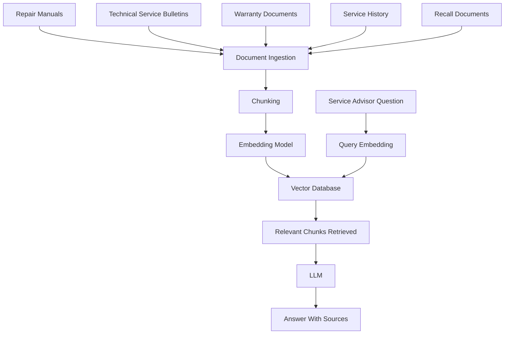

# Real-Time Case Study: Volkswagen Vehicle Service Intelligence Platform using RAG + Vector Database

## Business Background

Volkswagen operates:

* Authorized service centers
* Customer support teams
* Technical support teams
* Warranty teams
* Roadside assistance teams

Thousands of documents are generated and maintained every year:

* Repair manuals
* Technical Service Bulletins (TSBs)
* Service procedures
* Diagnostic guides
* Warranty policies
* Recall notices
* Vehicle owner manuals
* Sensor troubleshooting documents
* Parts catalogs
* Historical service records

Technicians often spend significant time searching through multiple systems before diagnosing a vehicle issue.

---

# Business Problem

A customer arrives with:

```text
Vehicle: Volkswagen Taigun
Model Year: 2022

Customer Complaints:
- Vehicle takes longer to start
- Fuel efficiency has reduced
- Engine warning light is ON

Battery Voltage:
11.4 V
```

The service advisor needs answers to:

* Similar historical cases
* Relevant repair procedures
* Related Technical Service Bulletins
* Warranty coverage
* Recommended inspections
* Similar resolved service records

Searching manually may take 20–30 minutes.

---

# Business Requirement

Build an AI-powered Service Knowledge Assistant.

Service advisors should ask:

> Why is a Taigun taking longer to start?

> Show relevant TSBs related to low battery voltage.

> What inspections are recommended for engine warning alerts?

> Find similar service cases from the last 12 months.

> Is this issue covered under warranty?

---

# Documents Available

| Source                     | Volume   |
| -------------------------- | -------- |
| Repair Manuals             | 10,000+  |
| TSB Documents              | 25,000+  |
| Warranty Policies          | 5,000+   |
| Vehicle Manuals            | 15,000+  |
| Historical Service Records | Millions |
| Recall Documents           | 50,000+  |

---

# RAG Architecture



---

# Example Documents

### Technical Service Bulletin

```text
TSB-2024-112

Vehicles may experience delayed starting
when battery voltage drops below 11.8V.

Recommended action:

1. Battery health test
2. Alternator output inspection
3. Starter circuit inspection
```

---

### Warranty Policy

```text
Battery warranty coverage:
36 months or 60,000 km,
whichever occurs first.
```

---

### Historical Service Record

```text
Vehicle:
Volkswagen Taigun

Symptoms:
Slow cranking
Engine warning alert

Root Cause:
Battery degradation

Resolution:
Battery replacement performed
after diagnostic confirmation.
```

---

# User Query

Service Advisor asks:

```text
Customer reports:

Vehicle takes longer to start.
Battery voltage is 11.4 V.
```

---

# Query Embedding

The question is converted into a vector.

```text
"Vehicle takes longer to start"

↓

[0.78, -0.34, 0.56, ...]
```

---

# Vector Search Results

Top matching chunks:

### Chunk 1

```text
TSB-2024-112

Delayed starting may occur
when battery voltage drops below 11.8V.
```

### Chunk 2

```text
Perform battery health testing
before considering replacement.
```

### Chunk 3

```text
Check alternator charging output
and starter circuit condition.
```

---

# Prompt Sent to LLM

```text
Context:

TSB-2024-112:
Delayed starting may occur when battery
voltage drops below 11.8V.

Recommended inspections:
Battery health test
Alternator inspection
Starter inspection

Question:
Vehicle takes longer to start.
Battery voltage 11.4V.
What should be recommended?
```

---

# LLM Response

```text
Based on retrieved Volkswagen service
documentation:

The reported delayed starting behavior
may be associated with battery voltage
below the referenced threshold.

Recommended inspections:

• Battery health test
• Battery load test
• Alternator charging inspection
• Starter circuit inspection

Further diagnosis by an authorized
Volkswagen technician is recommended.

Sources:
TSB-2024-112
Battery Diagnostic Procedure V3.2
```

---

# Additional Use Cases

### Warranty Search

Question:

```text
Is the battery covered under warranty?
```

RAG retrieves:

```text
Battery warranty:
36 months or 60,000 km
```

LLM generates:

```text
Coverage may apply depending on
vehicle age and mileage.
Verify warranty eligibility.
```

---

### Recall Search

Question:

```text
Any recalls related to starting issues?
```

RAG retrieves recall notices and presents only the relevant ones.

---

### Similar Case Search

Question:

```text
Show similar Taigun cases with
battery voltage below 11.5V.
```

Vector search finds semantically similar historical repair records even when exact keywords differ.

---

# Business Benefits

| Benefit                    | Value                                          |
| -------------------------- | ---------------------------------------------- |
| Faster diagnosis           | 30 min → <1 min                                |
| Consistent recommendations | Same guidance across service centers           |
| Reduced manual search      | Technical documents searched automatically     |
| Better customer experience | Faster service advisory                        |
| Lower hallucination        | Answers grounded in Volkswagen documents       |
| Knowledge retention        | Expert technician knowledge becomes searchable |

---

# Final Outcome

Volkswagen's RAG-powered Service Intelligence Platform enables service advisors and technicians to query millions of pages of technical documentation, historical repairs, TSBs, warranty policies, and recall notices in natural language, receiving accurate, source-backed recommendations within seconds instead of manually searching through multiple systems.
