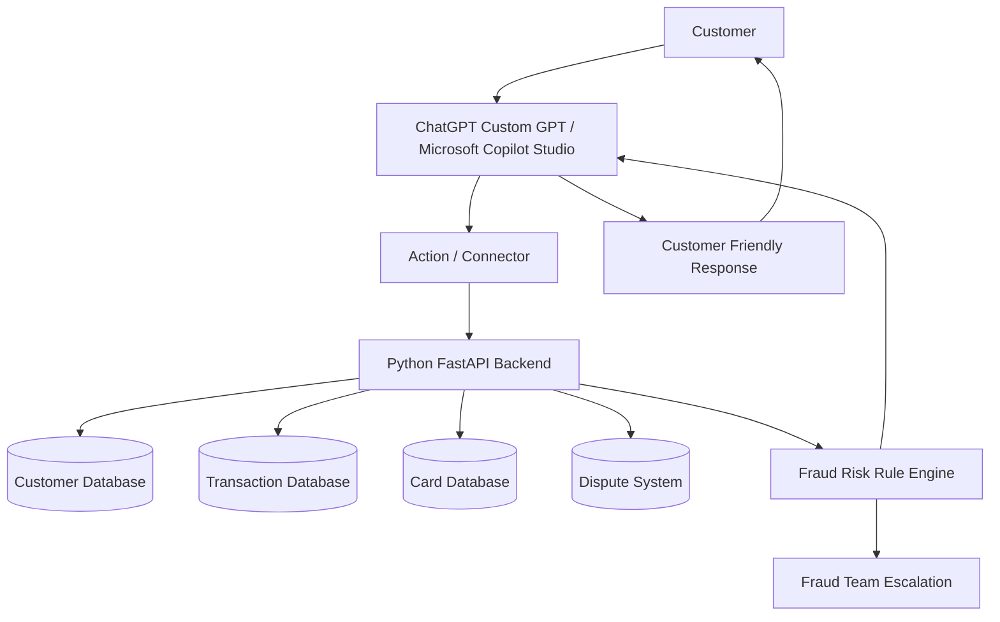

# Banking Fraud & Customer Support Virtual Assistant

## Using ChatGPT / Microsoft Copilot + Python Business APIs

## Case Study

**Industry:** Banking / Financial Services
**Company:** ABC Bank
**Goal:** Build a virtual assistant that helps customers with:

* Suspicious transaction detection
* Card blocking request
* Refund/dispute status
* Account balance summary
* Transaction explanation
* Human fraud-team escalation

---

# Architecture



---

# User Example

```text
I see a transaction of ₹48,500 from my credit card yesterday.
I did not make this payment.
Please check and block my card if needed.
```

---

# Internal Flow

```text
1. ChatGPT/Copilot understands intent = suspicious transaction
2. Extracts amount = ₹48,500
3. Extracts action = check transaction + possible card block
4. Calls Python API
5. Python API checks transaction risk
6. API returns fraud risk category
7. ChatGPT/Copilot explains result
8. If risk is high, card-block and dispute flow is triggered
```

---

# Python Project Structure

```text
banking-fraud-assistant/
│
├── main.py
├── data.py
├── fraud_engine.py
└── requirements.txt
```

---

# requirements.txt

```txt
fastapi
uvicorn
pydantic
```

---

# data.py

```python
customers = {
    "CUST1001": {
        "name": "Rahul Sharma",
        "account_status": "Active",
        "registered_city": "Pune",
        "risk_profile": "Medium"
    }
}

cards = {
    "CARD9001": {
        "customer_id": "CUST1001",
        "card_type": "Credit Card",
        "status": "Active",
        "last_four_digits": "8821"
    }
}

transactions = {
    "TXN5001": {
        "customer_id": "CUST1001",
        "card_id": "CARD9001",
        "amount": 48500,
        "merchant": "Global Electronics Dubai",
        "location": "Dubai",
        "transaction_type": "International",
        "timestamp": "2026-06-24 22:15",
        "otp_verified": False,
        "previous_similar_transaction": False
    },
    "TXN5002": {
        "customer_id": "CUST1001",
        "card_id": "CARD9001",
        "amount": 1250,
        "merchant": "Amazon India",
        "location": "Pune",
        "transaction_type": "Domestic",
        "timestamp": "2026-06-23 11:10",
        "otp_verified": True,
        "previous_similar_transaction": True
    }
}

disputes = {}
```

---

# fraud_engine.py

```python
def calculate_fraud_risk(transaction):
    risk_score = 0
    reasons = []
    actions = []

    if transaction["amount"] >= 40000:
        risk_score += 3
        reasons.append("High-value transaction detected.")

    if transaction["transaction_type"] == "International":
        risk_score += 3
        reasons.append("International transaction detected.")

    if not transaction["otp_verified"]:
        risk_score += 3
        reasons.append("Transaction was not OTP verified.")

    if not transaction["previous_similar_transaction"]:
        risk_score += 2
        reasons.append("No previous similar transaction found.")

    if transaction["location"] != "Pune":
        risk_score += 2
        reasons.append("Transaction location is different from customer's registered city.")

    if risk_score >= 9:
        risk_category = "High"
        actions.extend([
            "Temporarily block the card",
            "Create fraud dispute case",
            "Escalate to fraud investigation team"
        ])
    elif risk_score >= 5:
        risk_category = "Medium"
        actions.extend([
            "Ask customer to confirm the transaction",
            "Recommend temporary card freeze"
        ])
    else:
        risk_category = "Low"
        actions.append("No immediate fraud action required")

    return {
        "risk_score": risk_score,
        "risk_category": risk_category,
        "reasons": reasons,
        "recommended_actions": actions
    }
```

---

# main.py

```python
from fastapi import FastAPI, HTTPException
from pydantic import BaseModel
from data import customers, cards, transactions, disputes
from fraud_engine import calculate_fraud_risk

app = FastAPI(
    title="Banking Fraud Virtual Assistant API",
    description="Backend API used by ChatGPT Custom GPT or Microsoft Copilot Studio",
    version="1.0.0"
)


class FraudCheckRequest(BaseModel):
    transaction_id: str
    customer_id: str


class CardBlockRequest(BaseModel):
    card_id: str
    customer_id: str
    reason: str


class DisputeRequest(BaseModel):
    transaction_id: str
    customer_id: str
    dispute_reason: str


@app.get("/")
def health_check():
    return {
        "message": "Banking Fraud Assistant API is running"
    }


@app.post("/fraud-check")
def fraud_check(request: FraudCheckRequest):

    transaction = transactions.get(request.transaction_id)

    if not transaction:
        raise HTTPException(
            status_code=404,
            detail="Transaction not found"
        )

    if transaction["customer_id"] != request.customer_id:
        raise HTTPException(
            status_code=403,
            detail="Transaction does not belong to this customer"
        )

    risk_result = calculate_fraud_risk(transaction)

    return {
        "transaction_id": request.transaction_id,
        "transaction_details": {
            "amount": transaction["amount"],
            "merchant": transaction["merchant"],
            "location": transaction["location"],
            "transaction_type": transaction["transaction_type"],
            "timestamp": transaction["timestamp"]
        },
        "fraud_assessment": risk_result
    }


@app.post("/block-card")
def block_card(request: CardBlockRequest):

    card = cards.get(request.card_id)

    if not card:
        raise HTTPException(
            status_code=404,
            detail="Card not found"
        )

    if card["customer_id"] != request.customer_id:
        raise HTTPException(
            status_code=403,
            detail="Card does not belong to this customer"
        )

    card["status"] = "Temporarily Blocked"

    return {
        "card_id": request.card_id,
        "status": card["status"],
        "reason": request.reason,
        "message": "Card has been temporarily blocked for customer safety."
    }


@app.post("/create-dispute")
def create_dispute(request: DisputeRequest):

    transaction = transactions.get(request.transaction_id)

    if not transaction:
        raise HTTPException(
            status_code=404,
            detail="Transaction not found"
        )

    dispute_id = f"DSP{len(disputes) + 1001}"

    disputes[dispute_id] = {
        "transaction_id": request.transaction_id,
        "customer_id": request.customer_id,
        "reason": request.dispute_reason,
        "status": "Created",
        "assigned_team": "Fraud Investigation Team"
    }

    return {
        "dispute_id": dispute_id,
        "status": "Created",
        "assigned_team": "Fraud Investigation Team",
        "message": "Fraud dispute case has been created."
    }


@app.get("/dispute-status/{dispute_id}")
def dispute_status(dispute_id: str):

    dispute = disputes.get(dispute_id)

    if not dispute:
        raise HTTPException(
            status_code=404,
            detail="Dispute case not found"
        )

    return dispute
```

---

# Run Application

```bash
uvicorn main:app --reload
```

Open:

```text
http://127.0.0.1:8000/docs
```

---

# Test `/fraud-check`

Request:

```json
{
  "transaction_id": "TXN5001",
  "customer_id": "CUST1001"
}
```

Response:

```json
{
  "transaction_id": "TXN5001",
  "transaction_details": {
    "amount": 48500,
    "merchant": "Global Electronics Dubai",
    "location": "Dubai",
    "transaction_type": "International",
    "timestamp": "2026-06-24 22:15"
  },
  "fraud_assessment": {
    "risk_score": 13,
    "risk_category": "High",
    "reasons": [
      "High-value transaction detected.",
      "International transaction detected.",
      "Transaction was not OTP verified.",
      "No previous similar transaction found.",
      "Transaction location is different from customer's registered city."
    ],
    "recommended_actions": [
      "Temporarily block the card",
      "Create fraud dispute case",
      "Escalate to fraud investigation team"
    ]
  }
}
```

---

# ChatGPT / Copilot Final Response

```text
This transaction appears to be High Risk based on the available information.

Transaction details:
- Amount: ₹48,500
- Merchant: Global Electronics Dubai
- Location: Dubai
- Type: International
- OTP Verified: No

Reasons:
- High-value transaction
- International usage
- No OTP verification
- Different location from your registered city
- No similar past transaction found

Recommended action:
For your safety, the card should be temporarily blocked and a fraud dispute case should be created.

Please confirm if you want me to proceed with blocking the card.
```

---

# If Customer Confirms

Customer:

```text
Yes, block my card and raise a dispute.
```

ChatGPT/Copilot calls:

```text
POST /block-card
POST /create-dispute
```

Final response:

```text
Your card has been temporarily blocked for safety.

A fraud dispute case has been created.

Dispute ID: DSP1001

The fraud investigation team will review this case.
```

---

