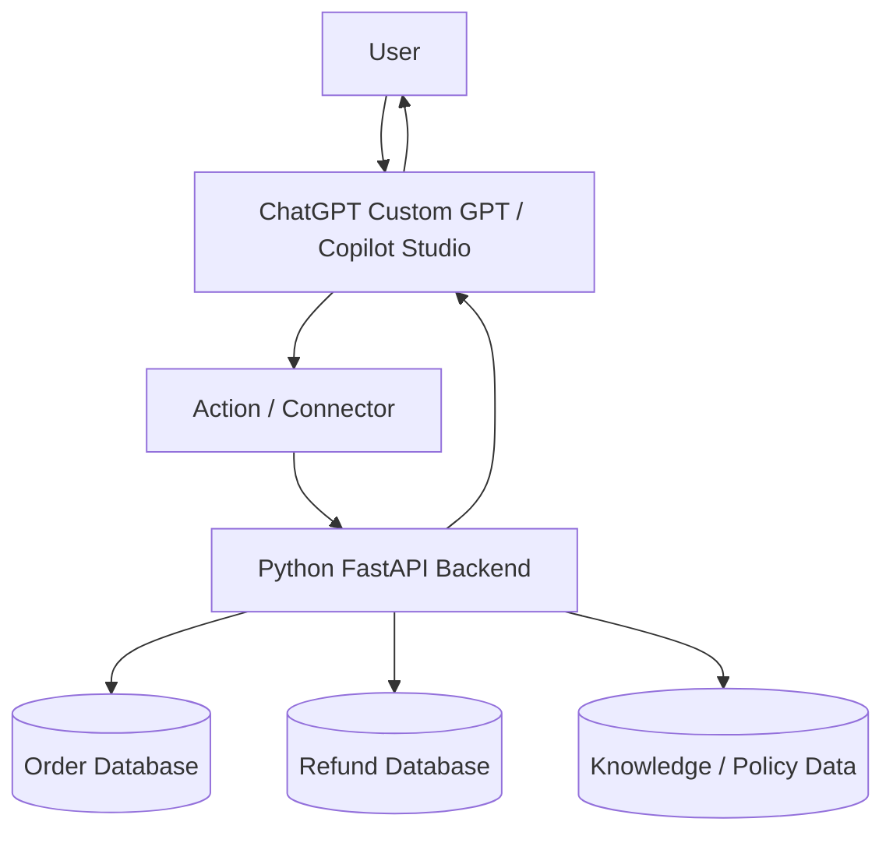

---

# Architecture with Python



---

# Python Project Structure

```text
chatbot-business-api/
│
├── main.py
├── requirements.txt
└── data.py
```

---

# requirements.txt

```txt
fastapi
uvicorn
pydantic
```

---

# data.py

```python
orders = {
    "458921": {
        "customer_name": "Rahul Sharma",
        "status": "Out for Delivery",
        "expected_delivery": "Tomorrow before 6 PM",
        "payment_status": "Paid"
    },
    "123456": {
        "customer_name": "Priya Mehta",
        "status": "Processing",
        "expected_delivery": "Within 3 days",
        "payment_status": "Paid"
    }
}

refunds = {
    "458921": {
        "refund_status": "Not Applicable",
        "reason": "Order is not returned"
    },
    "789101": {
        "refund_status": "Processed",
        "refund_date": "24 June 2026",
        "amount": 2499
    }
}

policies = {
    "return_policy": """
    Products can be returned within 7 days of delivery.
    The product must be unused and in original packaging.
    Refund is processed after quality check.
    """,

    "refund_policy": """
    Refunds are usually processed within 5 to 7 business days
    after the returned product passes inspection.
    """
}
```

---

# main.py

```python
from fastapi import FastAPI, HTTPException
from pydantic import BaseModel
from data import orders, refunds, policies

app = FastAPI(
    title="Enterprise Chatbot Business API",
    description="Backend API used by ChatGPT Custom GPT or Microsoft Copilot Studio",
    version="1.0.0"
)


class OrderRequest(BaseModel):
    order_id: str


class PolicyRequest(BaseModel):
    policy_name: str


@app.get("/")
def health_check():
    return {
        "message": "Chatbot Business API is running"
    }


@app.post("/order-status")
def get_order_status(request: OrderRequest):
    order = orders.get(request.order_id)

    if not order:
        raise HTTPException(
            status_code=404,
            detail="Order ID not found"
        )

    return {
        "order_id": request.order_id,
        "status": order["status"],
        "expected_delivery": order["expected_delivery"],
        "payment_status": order["payment_status"]
    }


@app.post("/refund-status")
def get_refund_status(request: OrderRequest):
    refund = refunds.get(request.order_id)

    if not refund:
        raise HTTPException(
            status_code=404,
            detail="Refund details not found for this order"
        )

    return {
        "order_id": request.order_id,
        "refund_details": refund
    }


@app.post("/policy")
def get_policy(request: PolicyRequest):
    policy = policies.get(request.policy_name)

    if not policy:
        raise HTTPException(
            status_code=404,
            detail="Policy not found"
        )

    return {
        "policy_name": request.policy_name,
        "policy_details": policy
    }
```

---

# Run the API

```bash
uvicorn main:app --reload
```

Open:

```text
http://127.0.0.1:8000/docs
```

---

# Test Order API

Request:

```json
{
  "order_id": "458921"
}
```

Response:

```json
{
  "order_id": "458921",
  "status": "Out for Delivery",
  "expected_delivery": "Tomorrow before 6 PM",
  "payment_status": "Paid"
}
```

---

# How ChatGPT / Copilot Uses This

User asks:

```text
Where is my order 458921?
```

ChatGPT / Copilot:

```text
1. Understands intent = Order Status
2. Extracts order_id = 458921
3. Calls Python API /order-status
4. Receives order data
5. Converts JSON into natural response
```

Final answer:

```text
Your order 458921 is currently out for delivery and is expected to arrive tomorrow before 6 PM.
```

---

# Important Point

You are **not using OpenAI Python SDK** here.

Python is used only for:

```text
Business logic
Order API
Refund API
Policy API
Database connection
CRM integration
ERP integration
```

ChatGPT Custom GPT or Copilot Studio handles:

```text
Natural language understanding
Intent detection
Response generation
Follow-up conversation
```
