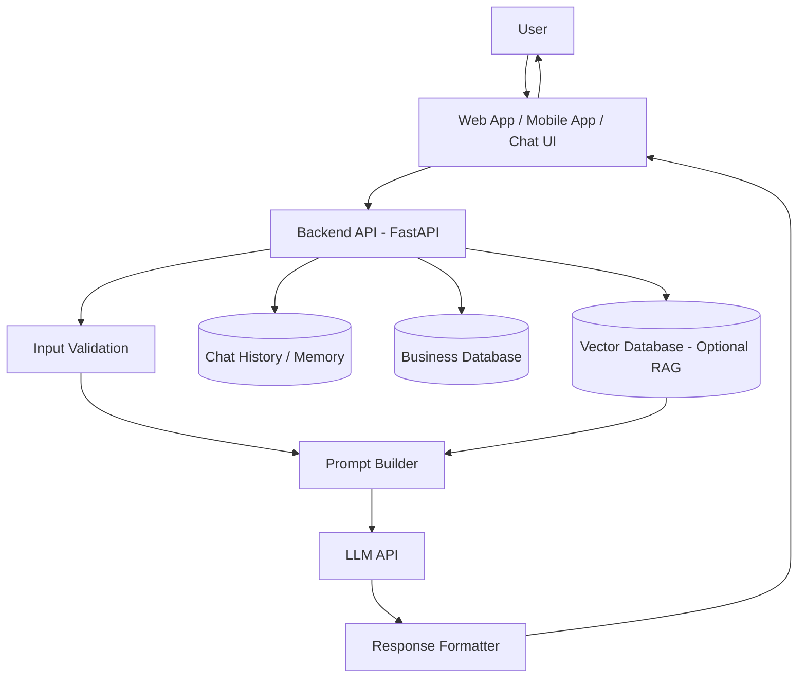
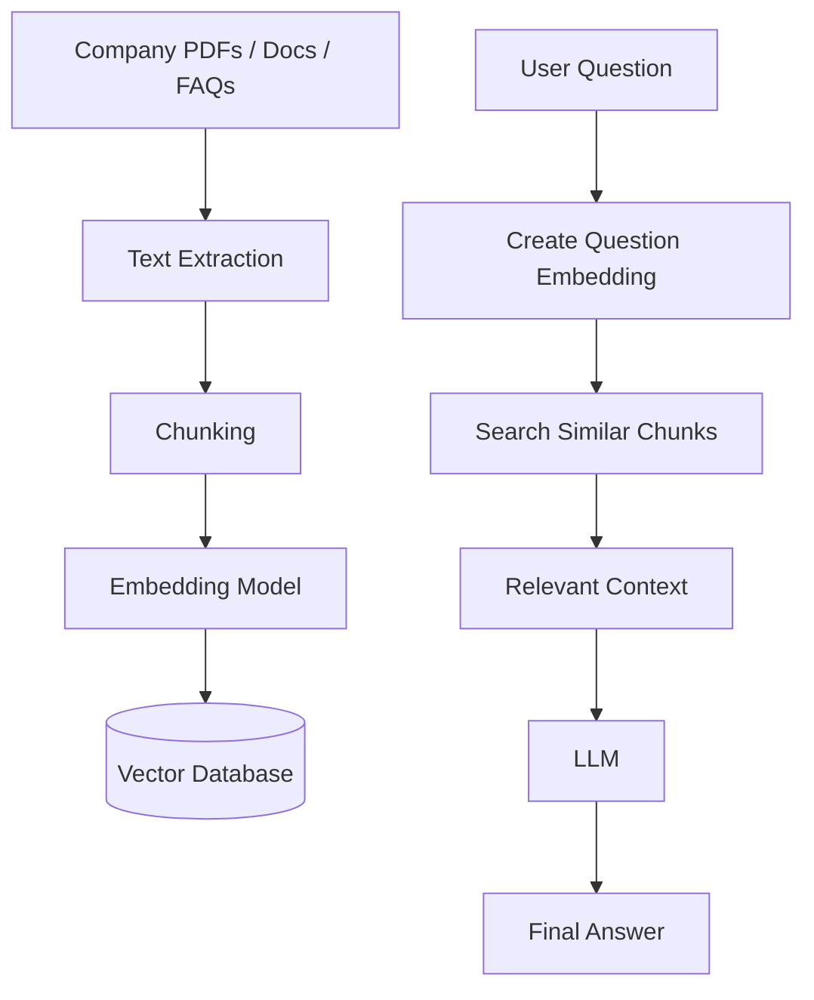
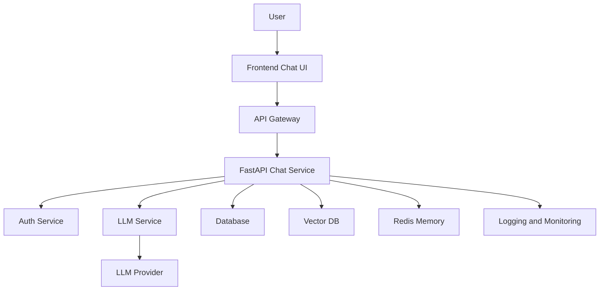

## Chatbots and Virtual Assistants using LLMs

### 1. What is it?

A chatbot or virtual assistant uses an LLM to understand user questions and generate human-like answers.

Example:

User asks:

```text
What is the status of my order?
```

LLM assistant replies:

```text
Your order is currently out for delivery and should arrive today by 6 PM.
```

---

## 2. Architecture



---

## 3. Step-by-step working

### Step 1: User enters a message

```text
I want to know my refund status.
```

### Step 2: Backend receives the request

The backend API accepts the user message.

### Step 3: Validate the input

Check:

```text
Is message empty?
Is message abusive?
Is it too long?
Does it contain sensitive data?
```

### Step 4: Add business instructions

Example system prompt:

```text
You are a customer support assistant.
Answer politely.
Do not invent information.
If order details are missing, ask for order ID.
```

### Step 5: Send prompt to LLM

The prompt and user message are sent to the LLM.

### Step 6: LLM generates response

The LLM predicts the best answer based on context.

### Step 7: Response sent to user

The chatbot displays the answer.

---

## 4. Simple Python Code using FastAPI

### Install libraries

```bash
pip install fastapi uvicorn openai python-dotenv
```

---

## 5. Project structure

```text
llm-chatbot/
│
├── main.py
├── .env
└── requirements.txt
```

---

## 6. `.env`

```env
OPENAI_API_KEY=your_api_key_here
```

---

## 7. `main.py`

```python
from fastapi import FastAPI
from pydantic import BaseModel
from openai import OpenAI
import os
from dotenv import load_dotenv

load_dotenv()

app = FastAPI()

client = OpenAI(api_key=os.getenv("OPENAI_API_KEY"))


class ChatRequest(BaseModel):
    user_message: str


@app.post("/chat")
def chat(request: ChatRequest):

    system_prompt = """
    You are a helpful customer support virtual assistant.

    Rules:
    - Answer clearly and politely.
    - Do not guess missing information.
    - If user asks about order, refund, payment, or delivery,
      ask for order ID if it is not provided.
    - Keep answers short and useful.
    """

    response = client.chat.completions.create(
        model="gpt-4.1-mini",
        messages=[
            {"role": "system", "content": system_prompt},
            {"role": "user", "content": request.user_message}
        ]
    )

    return {
        "reply": response.choices[0].message.content
    }
```

---

## 8. Run the app

```bash
uvicorn main:app --reload
```

Test URL:

```text
http://127.0.0.1:8000/docs
```

---

## 9. Sample request

```json
{
  "user_message": "Where is my order?"
}
```

### Sample response

```json
{
  "reply": "Please share your order ID so I can help you check the order status."
}
```

---

## 10. Chatbot with memory

Without memory:

```text
User: My order ID is 12345
Bot: Okay
User: What is the status?
Bot: Please share order ID
```

With memory:

```text
Bot remembers order ID 12345 from previous message.
```

Simple memory example:

```python
chat_history = []


@app.post("/chat-with-memory")
def chat_with_memory(request: ChatRequest):

    system_prompt = """
    You are a helpful virtual assistant.
    Use the conversation history to answer correctly.
    """

    chat_history.append({
        "role": "user",
        "content": request.user_message
    })

    messages = [{"role": "system", "content": system_prompt}] + chat_history

    response = client.chat.completions.create(
        model="gpt-4.1-mini",
        messages=messages
    )

    bot_reply = response.choices[0].message.content

    chat_history.append({
        "role": "assistant",
        "content": bot_reply
    })

    return {"reply": bot_reply}
```

---

## 11. RAG-based chatbot architecture

Use RAG when chatbot must answer from company documents.



---

## 12. Where LLM is used

| Area                        | Role of LLM                      |
| --------------------------- | -------------------------------- |
| Understanding user question | Detects intent                   |
| Generating response         | Creates natural answer           |
| Summarizing documents       | Makes long text short            |
| RAG answer generation       | Answers using retrieved context  |
| Sentiment handling          | Understands angry/confused users |
| Follow-up questions         | Maintains conversation flow      |

---

## 13. Real-world example

### Use case: Banking assistant

User:

```text
Why was my credit card charged twice?
```

Assistant flow:

```text
1. Understands issue: duplicate charge
2. Asks for transaction ID if missing
3. Fetches transaction data from database
4. Explains status
5. Creates support ticket if needed
```

---

## 14. Production architecture



---

## 15. Important production features

| Feature              | Purpose                 |
| -------------------- | ----------------------- |
| Authentication       | Identify user           |
| Rate limiting        | Prevent abuse           |
| Prompt guardrails    | Control LLM behavior    |
| Chat history         | Remember conversation   |
| Database integration | Fetch real data         |
| RAG                  | Answer from documents   |
| Monitoring           | Track errors and cost   |
| Human handoff        | Transfer to human agent |

---

## 16. Simple prompt template

```text
You are a professional customer support assistant.

Context:
{retrieved_context}

User Question:
{user_question}

Rules:
- Answer only from the given context.
- If answer is not available, say you do not have enough information.
- Do not hallucinate.
- Keep the answer simple.
```

---

## 17. Summary

LLM chatbot flow:

```text
User Message
→ Backend API
→ Prompt Preparation
→ Optional Database / RAG Search
→ LLM
→ Response Formatting
→ User
```

