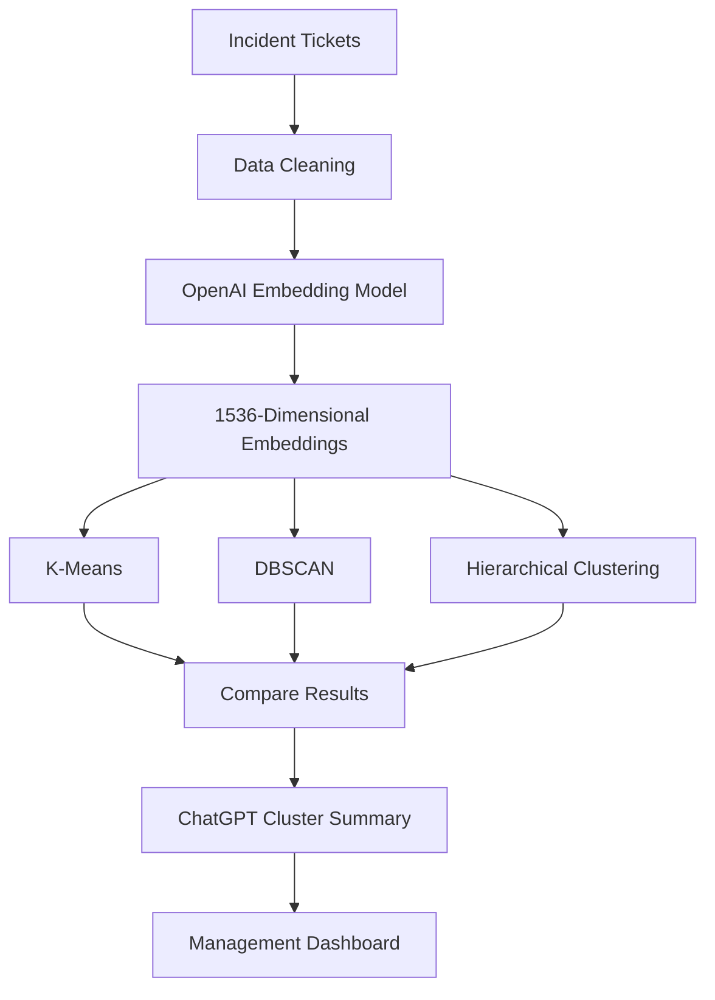

---

# Case Study: Software Incident Ticket Clustering Using LLM Embeddings

## Business Problem

A multinational IT company receives over **250,000 incident tickets** each year from employees across different countries.

Tickets originate from:

* IT Service Desk
* Microsoft Teams Support Bot
* Email Support
* ServiceNow
* Internal Help Portal

Examples:

```text
Unable to connect to VPN after password reset.

VPN authentication fails every morning.

Cannot access SAP after MFA update.

Outlook crashes whenever I open shared mailbox.

Teams meeting audio disconnects after 10 minutes.

Laptop battery drains within two hours.

Excel freezes while opening large files.

Unable to print to network printer.

Azure Virtual Desktop disconnects randomly.

OneDrive files are not syncing.
```

---

# Existing Problem

Currently,

* Engineers manually assign categories.
* Similar issues receive different labels.
* Duplicate incidents are difficult to identify.
* Root-cause analysis is delayed.
* Reporting is inconsistent across regions.

Example:

```text
VPN not connecting

VPN authentication failure

Remote access problem

Unable to connect through corporate VPN
```

All represent the same issue but are treated separately.

---

# Business Objective

Automatically group similar incidents into clusters to:

* Detect recurring IT issues.
* Identify duplicate tickets.
* Prioritize widespread problems.
* Improve service desk response times.
* Generate dashboards for IT management.

---

# Why High-Dimensional Data?

Each incident is converted into an embedding.

Example:

```text
Unable to connect to VPN
```

↓

```text
[0.124,
-0.781,
0.553,
...
1536 dimensions]
```

Using:

```text
OpenAI text-embedding-3-small
```

or

```text
text-embedding-3-large
```

Each ticket becomes a **1536-dimensional vector**.

---

# Architecture



---

# Sample Dataset

```python
tickets = [

"Unable to connect to VPN after password reset",

"VPN authentication keeps failing",

"Cannot login to VPN",

"Outlook crashes while opening mailbox",

"Email application freezes frequently",

"Microsoft Outlook closes unexpectedly",

"Laptop battery drains very quickly",

"Battery backup reduced after Windows update",

"Laptop shuts down after 2 hours",

"Printer not responding",

"Cannot print documents",

"Network printer offline",

"SAP login failed",

"Unable to access SAP",

"SAP authentication error",

"Teams audio disconnects",

"Teams microphone not working",

"Meeting voice cuts frequently"

]
```

---

# Objective

Compare

* K-Means
* DBSCAN
* Hierarchical Clustering

on the **same embedding vectors**.

---

# Solution Flow

```text
Tickets
      ↓
OpenAI Embeddings
      ↓
1536-D vectors
      ↓
PCA (optional visualization)
      ↓
Apply KMeans
      ↓
Apply DBSCAN
      ↓
Apply Hierarchical Clustering
      ↓
Compare clusters
      ↓
ChatGPT explains each cluster
```

---

# Algorithm Comparison

## 1. K-Means

Works well when

* Number of clusters is known.
* Clusters are compact.
* Dataset is large.

Example output

| Cluster | Topic          |
| ------- | -------------- |
| 0       | VPN Issues     |
| 1       | Outlook Issues |
| 2       | Battery Issues |
| 3       | SAP Issues     |
| 4       | Teams Issues   |
| 5       | Printer Issues |

---

## 2. DBSCAN

Advantages

No need to specify number of clusters.

Automatically detects

* dense regions
* noise
* outliers

Example

```text
VPN Issues

VPN Authentication

VPN Login Failure

↓

Cluster 0
```

Random ticket

```text
Mouse cursor moving slowly
```

↓

```text
Noise (-1)
```

DBSCAN marks it as

```text
Outlier
```

---

## 3. Hierarchical Clustering

Creates a tree of clusters.

Example

```text
IT Support

│

├── Network

│ ├── VPN

│ ├── Firewall

│

├── Microsoft

│ ├── Outlook

│ ├── Teams

│

├── Hardware

│ ├── Battery

│ ├── Printer
```

Very useful for IT management.

---

# Expected Discussion

Students compare

| Question                 | K-Means   | DBSCAN             | Hierarchical         |
| ------------------------ | --------- | ------------------ | -------------------- |
| Need number of clusters? | Yes       | No                 | No                   |
| Detect outliers?         | No        | Yes                | Limited              |
| Large datasets           | Excellent | Moderate           | Slower               |
| Cluster hierarchy        | No        | No                 | Yes                  |
| Best for embeddings      | Good      | Good (with tuning) | Good for exploration |

---

# Business Insights with ChatGPT

Once clustering is complete, send each cluster to ChatGPT.

Prompt:

```text
You are an IT Service Management expert.

The following incident tickets belong to one cluster.

1. VPN authentication failed

2. Cannot login to VPN

3. Unable to connect through VPN

Generate

• Cluster Name

• Common Issue

• Possible Root Cause

• Priority

• Recommended Resolution

• Business Impact
```

Example response:

```json
{
  "cluster_name":"VPN Connectivity Issues",
  "common_issue":"Remote users cannot establish VPN sessions.",
  "possible_root_cause":"Authentication configuration or VPN gateway issue.",
  "priority":"High",
  "recommended_resolution":"Review authentication logs, VPN gateway health, and MFA configuration.",
  "business_impact":"Employees may be unable to access corporate resources remotely."
}
```

---

# Learning Outcomes

By completing this case study, learners will understand:

1. How text is converted into high-dimensional embeddings.
2. Why clustering works directly on embedding vectors.
3. The differences between **K-Means**, **DBSCAN**, and **Hierarchical Clustering**.
4. How dimensionality reduction (e.g., PCA) helps visualize high-dimensional data.
5. How ChatGPT can automatically summarize, name, and prioritize discovered clusters for business users.

