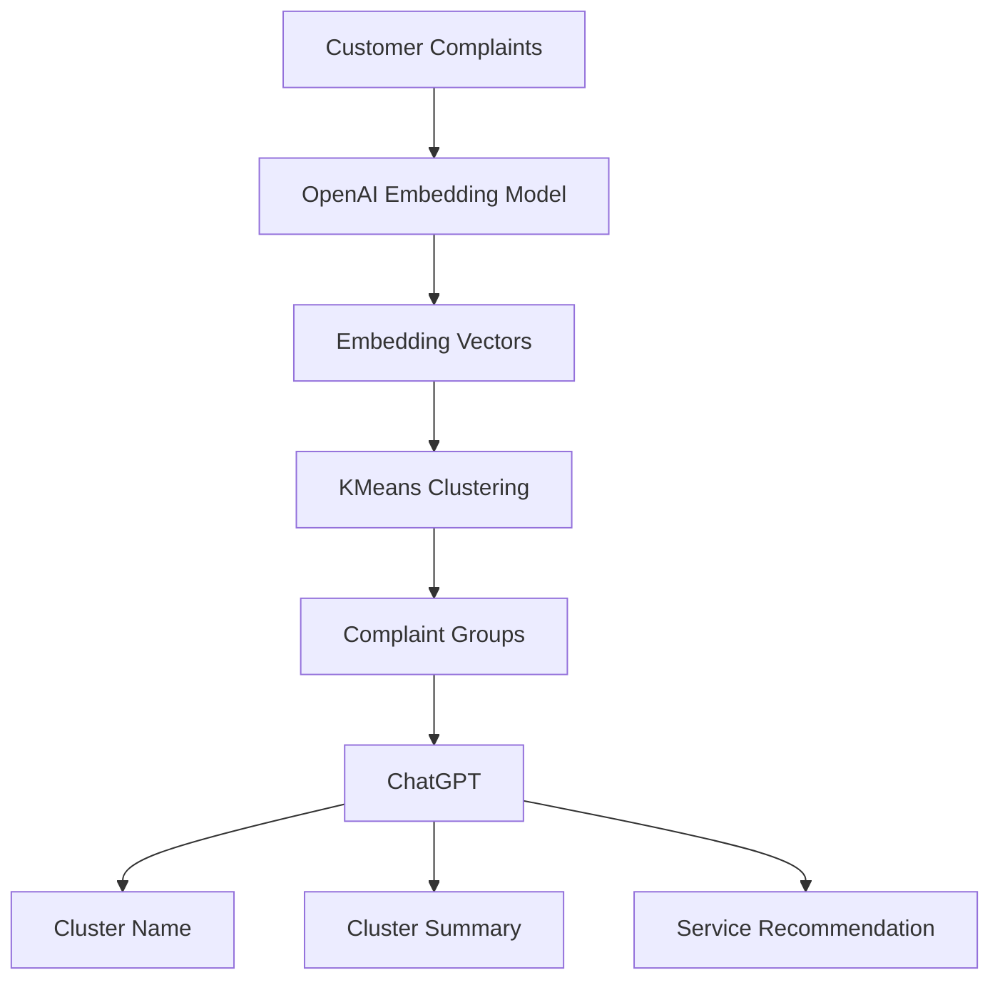

## ChatGPT-Based Clustering Case Study

### Architecture



## Install

```bash
pip install openai pandas scikit-learn matplotlib
```

Set API key:

```bash
export OPENAI_API_KEY="your_api_key_here"
```

## Complete Python Code

```python
import os
import json
import pandas as pd
from openai import OpenAI
from sklearn.cluster import KMeans
from sklearn.decomposition import PCA
import matplotlib.pyplot as plt

client = OpenAI(api_key=os.getenv("OPENAI_API_KEY"))

# -------------------------------
# 1. Sample complaint dataset
# -------------------------------

complaints = [
    "My car takes longer to start in the morning",
    "Battery voltage is low and vehicle cranks slowly",
    "Vehicle does not start immediately",
    "Engine warning light is displayed on dashboard",
    "Check engine light is blinking",
    "Engine alert appeared while driving",
    "Braking noise is coming from front wheels",
    "Brake pedal feels hard and noise is heard",
    "There is a squeaking sound while braking",
    "Fuel efficiency has reduced significantly",
    "Mileage has dropped after last service",
    "Vehicle is consuming more fuel than usual"
]

df = pd.DataFrame({"complaint": complaints})

# -------------------------------
# 2. Generate embeddings
# -------------------------------

embedding_response = client.embeddings.create(
    model="text-embedding-3-small",
    input=complaints
)

embeddings = [item.embedding for item in embedding_response.data]

# -------------------------------
# 3. Apply clustering
# -------------------------------

kmeans = KMeans(
    n_clusters=4,
    random_state=42,
    n_init=10
)

df["cluster"] = kmeans.fit_predict(embeddings)

print("\nClustered Complaints:")
print(df)

# -------------------------------
# 4. Use ChatGPT to name clusters
# -------------------------------

def analyze_cluster(cluster_id, cluster_complaints):
    prompt = f"""
You are an automotive service analytics expert.

Analyze the following customer complaints from one cluster:

{json.dumps(cluster_complaints, indent=2)}

Return JSON with:
- cluster_name
- common_theme
- possible_vehicle_system
- service_recommendation
- priority
"""

    response = client.responses.create(
        model="gpt-4.1-mini",
        input=prompt
    )

    return response.output_text


cluster_reports = []

for cluster_id in sorted(df["cluster"].unique()):
    cluster_complaints = df[df["cluster"] == cluster_id]["complaint"].tolist()
    analysis = analyze_cluster(cluster_id, cluster_complaints)

    cluster_reports.append({
        "cluster": cluster_id,
        "complaints": cluster_complaints,
        "chatgpt_analysis": analysis
    })

# -------------------------------
# 5. Display ChatGPT analysis
# -------------------------------

for report in cluster_reports:
    print("\n==============================")
    print(f"Cluster {report['cluster']}")
    print("==============================")
    print(report["chatgpt_analysis"])

# -------------------------------
# 6. Optional visualization
# -------------------------------

pca = PCA(n_components=2)
points = pca.fit_transform(embeddings)

df["x"] = points[:, 0]
df["y"] = points[:, 1]

plt.figure(figsize=(8, 6))
plt.scatter(df["x"], df["y"], c=df["cluster"])

for i, row in df.iterrows():
    plt.text(row["x"], row["y"], str(i))

plt.title("Customer Complaint Clustering Using OpenAI Embeddings")
plt.xlabel("PCA 1")
plt.ylabel("PCA 2")
plt.show()
```

## Expected ChatGPT Output Example

```json
{
  "cluster_name": "Battery and Starting Issues",
  "common_theme": "Customers are reporting slow start or low battery-related symptoms.",
  "possible_vehicle_system": "Battery, starter motor, charging system",
  "service_recommendation": "Perform battery health test, charging system inspection, and starter motor check.",
  "priority": "High"
}
```

## Where ChatGPT Is Used

| Step                            | Tool                   |
| ------------------------------- | ---------------------- |
| Convert complaints into vectors | OpenAI Embedding Model |
| Group similar complaints        | KMeans                 |
| Name each cluster               | ChatGPT                |
| Summarize customer issues       | ChatGPT                |
| Recommend business action       | ChatGPT                |

This is the proper ChatGPT-based solution: **embeddings for grouping + ChatGPT for interpretation**.

[1]: https://platform.openai.com/docs/guides/embeddings "Vector embeddings | OpenAI API"
[2]: https://platform.openai.com/docs/api-reference/responses "Responses | OpenAI API Reference"
