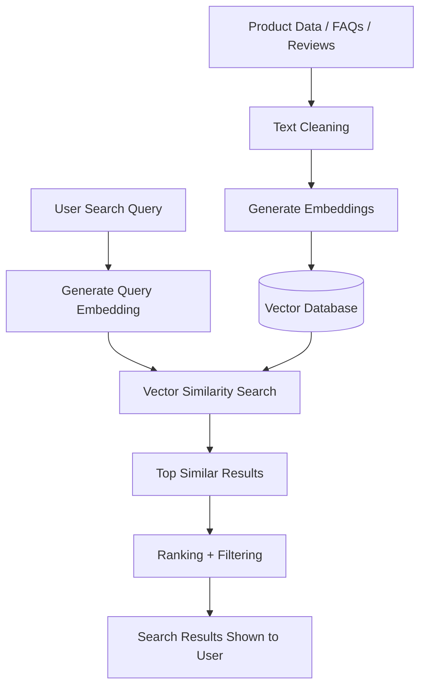

## Case Study: Semantic Search Using Vector Similarity

### 1. Business Problem

An e-commerce company has thousands of product descriptions, reviews, FAQs, and return-policy documents.

Customers search like this:

```text
I need shoes for daily walking with good cushioning
```

But the product database may contain text like:

```text
Lightweight running sneakers with soft foam support
```

Traditional keyword search may fail because the words are different:

```text
walking ≠ running
cushioning ≠ foam support
```

So the company needs **semantic search**, where search works by meaning, not exact words.

---

## 2. Objective

Build a system that can:

```text
Understand user query meaning
Find similar products/documents
Return top matching results
Rank results using vector similarity
```

---

## 3. What is Semantic Search?

Semantic search finds results based on **meaning similarity**.

Example:

User query:

```text
comfortable laptop bag for office
```

Matching result:

```text
professional backpack with padded laptop compartment
```

Even though exact words are different, meaning is similar.

---

## 4. How Vector Similarity Works

Text is converted into embeddings.

```text
"office laptop backpack"
        ↓
[0.12, -0.45, 0.78, 0.33, ...]
```

Each product/document also becomes a vector.

Then we compare query vector with stored vectors.

Common similarity method:

```text
Cosine Similarity
```

Higher cosine similarity means more semantically similar.

---

## 5. Architecture



---

## 6. Sample Data

```python
products = [
    "Lightweight running shoes with soft foam cushioning",
    "Formal leather shoes for office and meetings",
    "Laptop backpack with padded compartment for office use",
    "Wireless noise cancelling headphones for travel",
    "Cotton t-shirt for casual summer wear",
    "Ergonomic office chair with lumbar support",
    "Waterproof hiking shoes for mountain trails"
]
```

User query:

```text
I need comfortable shoes for daily walking
```

Expected result:

```text
Lightweight running shoes with soft foam cushioning
```

Because the meaning is close to walking + comfort.

---

## 7. Step-by-Step Solution

### Step 1: Collect text data

Data can come from:

```text
Product catalog
Customer reviews
FAQs
Support tickets
Policy documents
Knowledge base
```

---

### Step 2: Clean the text

Do only light cleaning.

```python
def clean_text(text):
    return text.strip()
```

Do not remove important words like:

```text
size 10
15-inch laptop
waterproof
leather
wireless
```

---

### Step 3: Convert text into embeddings

Use an embedding model.

Example models:

```text
SentenceTransformer
OpenAI embeddings
Cohere embeddings
Amazon Titan embeddings
Azure OpenAI embeddings
```

---

### Step 4: Store embeddings in vector database

Vector database options:

```text
FAISS
ChromaDB
Pinecone
Weaviate
Milvus
Qdrant
OpenSearch Vector Engine
```

---

### Step 5: Convert user query into vector

```text
"I need comfortable shoes for daily walking"
        ↓
Query embedding vector
```

---

### Step 6: Compare query vector with product vectors

Use cosine similarity.

```text
Query vector compared with all product vectors
```

---

### Step 7: Return top-K similar results

Example:

```text
Top 3 results:
1. Lightweight running shoes with soft foam cushioning
2. Waterproof hiking shoes for mountain trails
3. Formal leather shoes for office and meetings
```

---

## 8. Python Code Example

```python
from sentence_transformers import SentenceTransformer
from sklearn.metrics.pairwise import cosine_similarity
import pandas as pd

products = [
    "Lightweight running shoes with soft foam cushioning",
    "Formal leather shoes for office and meetings",
    "Laptop backpack with padded compartment for office use",
    "Wireless noise cancelling headphones for travel",
    "Cotton t-shirt for casual summer wear",
    "Ergonomic office chair with lumbar support",
    "Waterproof hiking shoes for mountain trails"
]

model = SentenceTransformer("all-MiniLM-L6-v2")

product_embeddings = model.encode(products)

query = "I need comfortable shoes for daily walking"
query_embedding = model.encode([query])

similarity_scores = cosine_similarity(query_embedding, product_embeddings)[0]

results = pd.DataFrame({
    "product": products,
    "similarity_score": similarity_scores
})

top_results = results.sort_values(
    by="similarity_score",
    ascending=False
)

print(top_results.head(3))
```

---

## 9. Expected Output

```text
                                          product  similarity_score
0  Lightweight running shoes with soft foam cushioning        0.72
6  Waterproof hiking shoes for mountain trails             0.48
1  Formal leather shoes for office and meetings             0.31
```

Scores may vary depending on model.

---

## 10. Where Vector Similarity is Used

```text
E-commerce product search
Document search
Resume matching
Legal document search
FAQ search
Chatbot retrieval
Recommendation systems
Image search
Duplicate detection
Knowledge base search
```

---

## 11. Real-Time Business Use Case

### Use Case: E-commerce Product Discovery

Customer searches:

```text
bag for carrying laptop to office
```

System finds:

```text
Laptop backpack with padded compartment for office use
```

Even if customer did not type:

```text
backpack
padded compartment
professional bag
```

Semantic search understands the meaning.

---

## 12. Final Summary

Semantic search uses embeddings to convert text into vectors.

Vector similarity compares the user query vector with stored document/product vectors.

Instead of matching exact keywords, it matches meaning.

```text
Keyword Search:
Matches words

Semantic Search:
Matches meaning
```
